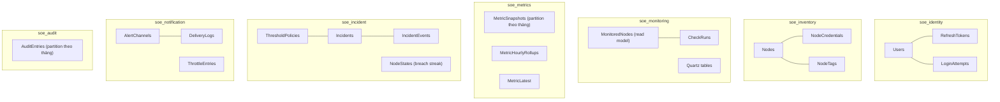

# Kiến trúc dữ liệu

> SQL Server 2022 · EF Core 8 · **database-per-service** · khóa chính GUID v7 (`UUID v7` — tuần tự theo thời gian, tránh phân mảnh index và không đoán được như số tăng dần).

---

## 1. Nguyên tắc

| # | Nguyên tắc |
|---|---|
| D1 | Mỗi service có database riêng, tài khoản SQL riêng, **không có FK xuyên service**; liên kết bằng `NodeId` dạng GUID (tham chiếu mềm). |
| D2 | Mọi bảng có `CreatedAt`, `UpdatedAt` (`datetimeoffset(3)`, UTC); bảng nghiệp vụ có `RowVersion` (`rowversion`) cho optimistic concurrency. |
| D3 | Schema thay đổi bằng **EF Core migration được commit**; production chạy migration có kiểm soát (job riêng), app không tự `EnsureCreated`. |
| D4 | Dữ liệu nhạy cảm: mật khẩu người dùng → Argon2id hash; credential SSH → AES-256-GCM; secret webhook → AES-256-GCM. Không cột nào lưu plaintext. |
| D5 | Xóa node là **soft delete** ở Inventory (`DeletedAt`), các service khác nhận `NodeDeletedV1` và tự dọn theo chính sách riêng. |
| D6 | Bảng dung lượng lớn (`MetricSnapshots`, `AuditEntries`) có chính sách retention + partition theo tháng. |

## 2. Sơ đồ tổng thể



Mọi database đều có thêm bảng của MassTransit: `OutboxMessage`, `OutboxState`, `InboxState`.

## 3. Lược đồ chi tiết

### 3.1 `soe_identity`

**Users**

| Cột | Kiểu | Ràng buộc | Ghi chú |
|---|---|---|---|
| `Id` | `uniqueidentifier` | PK | GUID v7 |
| `Username` | `nvarchar(64)` | NOT NULL, UNIQUE | Chữ thường, `^[a-z0-9._-]{3,64}$` |
| `PasswordHash` | `varchar(256)` | NOT NULL | Argon2id (có salt, tham số nhúng) |
| `FullName` | `nvarchar(128)` | NOT NULL | |
| `Email` | `nvarchar(256)` | NOT NULL, UNIQUE | |
| `Role` | `varchar(16)` | NOT NULL, CHECK IN (`ADMIN`,`OPERATOR`,`VIEWER`) | |
| `IsActive` | `bit` | NOT NULL DEFAULT 1 | |
| `FailedLoginCount` | `int` | NOT NULL DEFAULT 0 | |
| `LockedUntil` | `datetimeoffset(3)` | NULL | |
| `PasswordChangedAt` | `datetimeoffset(3)` | NOT NULL | Token phát hành trước mốc này bị từ chối |
| `LastLoginAt` | `datetimeoffset(3)` | NULL | |
| `CreatedAt`/`UpdatedAt`/`RowVersion` | | | |

**RefreshTokens**: `Id`, `UserId`, `TokenHash varbinary(32) UNIQUE`, `FamilyId`, `ExpiresAt`, `UsedAt`, `RevokedAt`, `RevokedReason`, `CreatedByIp`, `UserAgentHash`. Index `(UserId, ExpiresAt)`. Dùng lại token đã `UsedAt` → thu hồi toàn bộ `FamilyId`.

**LoginAttempts**: `Id`, `Username`, `IpHash`, `Succeeded`, `AttemptedAt`. Retention 90 ngày.

### 3.2 `soe_inventory`

**Nodes**

| Cột | Kiểu | Ràng buộc | Ghi chú |
|---|---|---|---|
| `Id` | `uniqueidentifier` | PK | |
| `Name` | `nvarchar(128)` | NOT NULL, UNIQUE (khi `DeletedAt IS NULL`) | |
| `Host` | `varchar(255)` | NOT NULL | IPv4/IPv6/hostname đã validate |
| `Port` | `int` | NOT NULL DEFAULT 22, CHECK 1..65535 | |
| `Username` | `varchar(64)` | NOT NULL | |
| `AuthType` | `varchar(16)` | NOT NULL, CHECK IN (`PASSWORD`,`SSH_KEY`) | |
| `CollectorType` | `varchar(16)` | NOT NULL DEFAULT `SSH` | Mở rộng: `LOCAL`, `WINRM` |
| `HostKeyFingerprint` | `varchar(96)` | NULL | SHA-256 base64, ghim sau lần kết nối đầu |
| `MonitorCpu`/`MonitorMemory`/`MonitorDisk` | `bit` | NOT NULL DEFAULT 1 | |
| `DiskMountPath` | `varchar(255)` | NOT NULL DEFAULT `/` | |
| `CheckIntervalSeconds` | `int` | NULL, CHECK 60..3600 | NULL = dùng mặc định hệ thống |
| `IsActive` | `bit` | NOT NULL DEFAULT 1 | Bật/tắt giám sát |
| `Description` | `nvarchar(512)` | NULL | |
| `DeletedAt` | `datetimeoffset(3)` | NULL | Soft delete |
| | | UNIQUE `(Host, Port)` khi `DeletedAt IS NULL` | Chặn trùng máy chủ (lỗ hổng v1) |

**NodeCredentials** (tách bảng để giới hạn quyền đọc)

| Cột | Kiểu | Ghi chú |
|---|---|---|
| `NodeId` | `uniqueidentifier` | PK/FK → `Nodes` |
| `SecretCipher` | `varbinary(max)` | `keyId‖nonce‖ciphertext‖tag` (AES-256-GCM) |
| `KeyId` | `varchar(16)` | Phục vụ xoay khóa |
| `PassphraseCipher` | `varbinary(max)` NULL | Cho private key có passphrase |
| `UpdatedAt` | | |

**NodeTags**: `NodeId`, `Key nvarchar(32)`, `Value nvarchar(64)`, PK `(NodeId, Key)` — phục vụ lọc/nhóm.

### 3.3 `soe_monitoring`

**MonitoredNodes** (read model, đồng bộ từ event — **không chứa credential**): `NodeId` PK, `Name`, `Host`, `Port`, `Username`, `CollectorType`, `MonitorCpu/Memory/Disk`, `DiskMountPath`, `CheckIntervalSeconds`, `IsActive`, `LastSyncedAt`.

**CheckRuns**: `CheckId` PK, `NodeId`, `Reason`, `RequestedBy`, `StartedAt`, `FinishedAt`, `Outcome` (`Success`/`Failed`), `FailureKind`, `DurationMs`, `WorkerInstance`. Index `(NodeId, StartedAt DESC)`. Retention 30 ngày — phục vụ chẩn đoán và test hiệu năng.

**Quartz**: bộ bảng chuẩn `QRTZ_*` cho chế độ clustered.

### 3.4 `soe_metrics`

**MetricSnapshots** (partition theo tháng trên `CollectedAt`)

| Cột | Kiểu | Ghi chú |
|---|---|---|
| `Id` | `bigint identity` | PK cụm với `CollectedAt` |
| `NodeId` | `uniqueidentifier` | |
| `CollectedAt` | `datetimeoffset(3)` | UNIQUE `(NodeId, CollectedAt)` — chống ghi trùng |
| `CpuPercent`/`MemoryPercent`/`DiskPercent` | `decimal(5,2)` NULL | `NULL` = không thu được |
| `DurationMs` | `int` | |

Index: `CREATE CLUSTERED INDEX IX_Metric_Node_Time ON MetricSnapshots(NodeId, CollectedAt DESC)`; nén `PAGE`.

**MetricHourlyRollups**: `NodeId`, `HourUtc`, `Avg/Max/Min` cho từng metric, `SampleCount`, PK `(NodeId, HourUtc)`. Job chạy mỗi giờ (+5 phút).

**MetricLatest**: `NodeId` PK + giá trị mới nhất + `CollectedAt` + `Status` — phục vụ dashboard 500 node bằng **một truy vấn**, có cache Redis 10 giây.

**Chọn nguồn theo dải thời gian:**

| `range` | Nguồn | Độ phân giải | Số điểm tối đa |
|---|---|---|---|
| `1h` | `MetricSnapshots` | 5 phút | 12 |
| `24h` | `MetricSnapshots` | 5 phút | 288 |
| `7d` | `MetricHourlyRollups` | 1 giờ | 168 |
| `30d` | `MetricHourlyRollups` | 4 giờ (gộp) | 180 |

**Retention:** snapshot thô 90 ngày (xóa theo partition switch — không `DELETE` hàng loạt), rollup 400 ngày.

### 3.5 `soe_incident`

**ThresholdPolicies**: `Id`, `Scope` (`GLOBAL`/`NODE`), `NodeId` NULL, `MetricType` (`CPU`/`MEMORY`/`DISK`), `WarningThreshold decimal(5,2)`, `CriticalThreshold decimal(5,2)`, `ConsecutiveBreaches int DEFAULT 2`, `RecoveryMargin decimal(5,2) DEFAULT 5`, `ConsecutiveRecoveries int DEFAULT 2`, `IsEnabled`. UNIQUE `(Scope, NodeId, MetricType)`; CHECK `WarningThreshold < CriticalThreshold`.

Mặc định (kế thừa v1): Disk 80/90 · CPU 75/85 · Memory 80/90.

**Incidents**

| Cột | Kiểu | Ghi chú |
|---|---|---|
| `Id` | `uniqueidentifier` | PK |
| `NodeId`, `NodeName` | | `NodeName` là bản sao để hiển thị khi node đã xóa |
| `Type` | `varchar(32)` | `CPU_HIGH`, `MEMORY_HIGH`, `DISK_HIGH`, `NODE_UNREACHABLE`, `HOST_KEY_MISMATCH`, `AUTH_FAILED` |
| `Severity` | `varchar(16)` | `WARNING`/`CRITICAL` |
| `Status` | `varchar(16)` | `OPEN`/`ACKNOWLEDGED`/`RESOLVED` |
| `MetricValue`, `ThresholdValue` | `decimal(5,2)` NULL | |
| `Description` | `nvarchar(512)` | tiếng Việt |
| `OccurrenceCount` | `int` DEFAULT 1 | Dedup |
| `DetectedAt`, `LastSeenAt`, `AcknowledgedAt`, `ResolvedAt` | `datetimeoffset(3)` | |
| `AcknowledgedBy`, `ResolvedBy` | `uniqueidentifier` NULL | |
| `ResolvedSource` | `varchar(16)` | `USER`/`SYSTEM` |
| `ResolutionAction` | `nvarchar(1000)` NULL | |

Chỉ mục & ràng buộc:
```sql
CREATE UNIQUE INDEX UX_Incident_Open ON Incidents(NodeId, Type) WHERE Status <> 'RESOLVED';  -- dedup
CREATE INDEX IX_Incident_List ON Incidents(Status, DetectedAt DESC) INCLUDE (NodeId, Severity, Type);
CREATE INDEX IX_Incident_Node ON Incidents(NodeId, DetectedAt DESC);
```

**IncidentEvents** (nhật ký vòng đời): `Id`, `IncidentId`, `Kind` (`OPENED`/`RECURRED`/`ESCALATED`/`ACKNOWLEDGED`/`RESOLVED`), `ActorId`, `Note`, `OccurredAt`.

**NodeStates**: `NodeId`+`MetricType` PK, `BreachStreak`, `RecoveryStreak`, `LastProcessedAt` — nơi lưu trạng thái đếm liên tiếp; `LastProcessedAt` giúp bỏ qua message tới muộn.

### 3.6 `soe_notification`

**AlertChannels**: `Id`, `Name nvarchar(128)`, `Type` (`EMAIL`/`WEBHOOK`), `Format` (`PLAIN`/`SLACK`/`TEAMS`/`DISCORD`/`GENERIC`), `TargetCipher varbinary(max)` (email hoặc URL — mã hóa vì có thể chứa token), `SecretCipher varbinary(max)` NULL (HMAC secret), `MinSeverity`, `IsEnabled`, `NodeFilterJson` NULL (lọc theo tag/node), `CreatedBy`, `CreatedAt`.

**DeliveryLogs**: `Id`, `ChannelId`, `IncidentId` NULL, `EventKind`, `DeliveryId` (idempotency), `Status` (`SENT`/`FAILED`/`SKIPPED_THROTTLED`), `Attempts`, `LatencyMs`, `ErrorMessage nvarchar(512)`, `SentAt`. UNIQUE `(DeliveryId)`. Retention 180 ngày.

**ThrottleEntries**: `Key varchar(128)` PK (`incidentId:channelId:kind`), `ExpiresAt` — hoặc dùng Redis TTL, bảng là bản dự phòng.

**Cấu hình SMTP** nằm ở bảng `SmtpSettings` (1 dòng, `PasswordCipher` mã hóa) để ADMIN sửa qua UI mà không phải deploy lại — kế thừa ý tưởng `SystemConfig` của v1 nhưng chỉ thuộc Notification.

### 3.7 `soe_audit`

**AuditEntries** (append-only, partition theo tháng)

| Cột | Kiểu | Ghi chú |
|---|---|---|
| `Id` | `bigint identity` | |
| `OccurredAt` | `datetimeoffset(3)` | Khóa partition |
| `ActorId`, `ActorName`, `ActorRole` | | `SYSTEM` cho hành động tự động |
| `Action` | `varchar(64)` | `NODE_CREATED`, `INCIDENT_RESOLVED`, `LOGIN_FAILED`… |
| `EntityType`, `EntityId` | | |
| `BeforeJson`, `AfterJson` | `nvarchar(max)` NULL | Đã lọc bỏ trường nhạy cảm |
| `CorrelationId`, `IpHash`, `UserAgentHash` | | |
| `Hash`, `PrevHash` | `varbinary(32)` | Chuỗi băm để phát hiện sửa đổi (tamper-evident) |

Quyền SQL: tài khoản service chỉ có `INSERT`/`SELECT`, **không có `UPDATE`/`DELETE`**; job dọn dữ liệu dùng tài khoản riêng và chỉ xóa partition quá 365 ngày.

## 4. Chiến lược migration & dữ liệu ban đầu

| Bước | Nội dung |
|---|---|
| 1 | Mỗi service có project migration riêng; CI chạy `dotnet ef migrations script --idempotent` sinh script SQL, review trong PR. |
| 2 | Deploy dùng **Job migration** chạy trước khi rollout pod mới; app pod khởi động với `Migrate on startup = false`. |
| 3 | Thay đổi phá vỡ tương thích theo mẫu **expand → migrate → contract** (thêm cột nullable → backfill → bỏ cột cũ ở release sau). |
| 4 | Seed ban đầu: 1 tài khoản `admin` (mật khẩu bắt buộc đổi lần đăng nhập đầu), threshold policy GLOBAL mặc định, kênh EMAIL mặc định (disabled). |
| 5 | Di trú dữ liệu từ v1 (tùy chọn): script đọc `Nodes`/`Incident_Logs`/`node_metrics` từ `smart_ops_engine`, **giải mã AES/ECB rồi mã hóa lại AES-GCM**, map `id` cũ → GUID mới, ghi bảng `LegacyIdMap`. |

## 5. Sao lưu & khôi phục

| Database | Backup | RPO | RTO | Ghi chú |
|---|---|---|---|---|
| `soe_identity`, `soe_inventory`, `soe_incident`, `soe_notification` | Full hằng ngày + log 15 phút | 15 phút | 1 giờ | Quan trọng nhất (credential, người dùng) |
| `soe_metrics` | Full hằng tuần + differential hằng ngày | 24 giờ | 4 giờ | Mất dữ liệu gần nhất chấp nhận được |
| `soe_audit` | Full hằng ngày, lưu 1 năm, WORM nếu có | 24 giờ | 4 giờ | Yêu cầu tuân thủ |

Kiểm tra khôi phục định kỳ mỗi quý; script kiểm tra tính liên tục chuỗi hash của `AuditEntries` sau khi restore.
