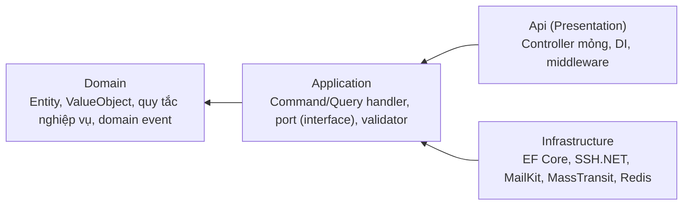

# Cấu trúc mã nguồn — Clean Architecture & SOLID

> Mục tiêu: mọi service có cùng khuôn hình, để lập trình viên đọc service này hiểu ngay service khác, và để quy tắc nghiệp vụ không dính vào hạ tầng (SSH, EF Core, RabbitMQ, SMTP).

---

## 1. Cấu trúc solution

```
Smart-Ops-Engine/
 ├── apps/backend-v3/
 │    ├── SmartOpsEngine.sln
 │    ├── src/
 │    │   ├── BuildingBlocks/
 │    │   │    ├── SOE.BuildingBlocks.Domain/          # Entity, AggregateRoot, ValueObject, DomainEvent, Result, Error
 │    │   │    ├── SOE.BuildingBlocks.Application/     # ICommand/IQuery, PipelineBehavior, IUserContext, IClock, PagedResult
 │    │   │    ├── SOE.BuildingBlocks.Infrastructure/  # EF base, Outbox/Inbox, MassTransit setup, Serilog, OpenTelemetry, HealthChecks
 │    │   │    ├── SOE.BuildingBlocks.Web/             # ProblemDetails, JWT auth, API versioning, security headers, CorrelationId middleware
 │    │   │    └── SOE.Contracts/                      # Integration event & command (versioned) — tham chiếu bởi mọi service
 │    │   ├── Gateway/
 │    │   │    └── SOE.Gateway/                        # YARP, rate limiting, CORS, aggregation tối thiểu
 │    │   └── Services/
 │    │        ├── Identity/
 │    │        │    ├── SOE.Identity.Domain/
 │    │        │    ├── SOE.Identity.Application/
 │    │        │    ├── SOE.Identity.Infrastructure/
 │    │        │    └── SOE.Identity.Api/
 │    │        ├── Inventory/      ... (4 project như trên)
 │    │        ├── Monitoring/     ... + SOE.Monitoring.Worker (host riêng cho consumer)
 │    │        ├── Metrics/        ...
 │    │        ├── Incident/       ...
 │    │        ├── Notification/   ...
 │    │        ├── Realtime/       (Domain mỏng: chỉ Api + Infrastructure)
 │    │        └── Audit/          ...
 │    └── tests/
 │         ├── SOE.<Service>.UnitTests/           # Domain + Application (không I/O)
 │         ├── SOE.<Service>.IntegrationTests/    # Testcontainers: SQL Server, RabbitMQ
 │         ├── SOE.ArchitectureTests/             # NetArchTest: ràng buộc phụ thuộc giữa layer
 │         └── SOE.ContractTests/                 # Schema event giữa producer/consumer
 ├── apps/web/                                    # React 19 (giữ nguyên repo hiện có, refactor theo docs)
 └── deploy/
      ├── docker/                                 # Dockerfile, docker-compose.yml, .env.example
      └── k8s/                                    # manifest/Helm chart, HPA, KEDA ScaledObject
```

## 2. Bốn lớp và chiều phụ thuộc



| Lớp | Được phép tham chiếu | Cấm |
|---|---|---|
| Domain | Không gì (ngoài BCL) | EF Core, HTTP, MassTransit, DTO |
| Application | Domain, BuildingBlocks.Application, SOE.Contracts | EF Core cụ thể, SSH.NET, SmtpClient |
| Infrastructure | Application, Domain | — |
| Api | Application, Infrastructure (chỉ ở `Program.cs` để đăng ký DI) | Truy cập trực tiếp `DbContext` trong controller |

Các ràng buộc trên được **kiểm tra tự động** bằng `SOE.ArchitectureTests` (NetArchTest) → xem `TC-<MOD>-UNIT-*` trong Đợt 3.

## 3. Khuôn mẫu một request

```
HTTP → Controller (Api)
     → MediatR Send(Command/Query)
        → ValidationBehavior      (FluentValidation, lỗi → 400 ProblemDetails)
        → LoggingBehavior         (correlation-id, thời gian xử lý)
        → TransactionBehavior     (mở transaction cho Command, lưu Outbox cùng lúc)
        → Handler (Application)   → gọi Domain, dùng port: IRepository, ICredentialProtector, IMetricCollector...
     ← Result<T> (không ném exception cho lỗi nghiệp vụ)
     ← Controller ánh xạ Result → 200/201/204 hoặc ProblemDetails
```

Quy ước: **lỗi nghiệp vụ trả về `Result.Failure(Error)`**, chỉ ném exception cho lỗi kỹ thuật (mất kết nối DB…). `Error` gồm `Code` (`SOE-INV-409`), `Message` tiếng Việt, `Type` (Validation / NotFound / Conflict / Forbidden / Unexpected).

## 4. Ánh xạ nguyên tắc SOLID

### S — Single Responsibility

| Đơn vị | Trách nhiệm duy nhất |
|---|---|
| `CreateNodeCommandHandler` | Điều phối tạo một node (validate nghiệp vụ, mã hóa qua port, lưu, phát event) |
| `SshMetricCollector` | Chạy lệnh SSH và phân tích kết quả thành `MetricSnapshot` |
| `ThresholdEvaluator` (Domain service) | So sánh snapshot với policy → trả `BreachResult` |
| `IncidentDeduplicator` | Quyết định mở mới / tăng đếm / nâng cấp severity |
| `EmailNotificationChannel` | Dựng và gửi một email |
| `AlertTemplateRenderer` | Sinh HTML từ template |

> Phản ví dụ của v1: `HealthCheckScheduler` vừa lập lịch, vừa SSH, vừa so ngưỡng, vừa tạo incident, vừa gửi email — thay bằng 4 service và 6 lớp ở trên.

### O — Open/Closed

| Điểm mở rộng | Cách thêm mới mà không sửa mã cũ |
|---|---|
| `IMetricCollector` | Thêm `WinRmMetricCollector` (Windows) hoặc `AgentPushCollector`; `CollectorFactory` chọn theo `Node.CollectorType` |
| `INotificationChannel` | Thêm `SmsNotificationChannel`; đăng ký DI là đủ, `AlertDispatcher` không đổi |
| `IWebhookPayloadFormatter` | Thêm `PagerDutyPayloadFormatter` bên cạnh Slack/Teams/Discord/Generic |
| `IThresholdRule` | Thêm luật mới (vd `DiskGrowthRateRule` dự báo đầy đĩa) vào danh sách rule |
| `IAuditEnricher` | Thêm thông tin bổ sung vào bản ghi audit |

```csharp
// Ví dụ: dispatcher không biết có bao nhiêu loại kênh
public sealed class AlertDispatcher(IEnumerable<INotificationChannel> channels, ...)
{
    public async Task DispatchAsync(AlertMessage msg, CancellationToken ct)
    {
        foreach (var target in await _channelStore.GetEnabledAsync(msg.Severity, ct))
        {
            var channel = channels.Single(c => c.Type == target.Type);   // EMAIL | WEBHOOK
            await _resiliencePipeline.ExecuteAsync(_ => channel.SendAsync(target, msg, ct));
        }
    }
}
```

### L — Liskov Substitution

- Mọi `IMetricCollector` phải: trả `MetricSnapshot` với giá trị `null` cho metric không thu được (không trả `-1` như v1), ném đúng `MetricCollectionException` khi không kết nối được, và **tôn trọng `CancellationToken` + timeout**. Bộ test dùng chung `MetricCollectorContractTests` chạy cho mọi hiện thực.
- Mọi `INotificationChannel.SendAsync` phải idempotent theo `AlertMessage.DeliveryId` và không ném exception cho lỗi nghiệp vụ (trả `DeliveryResult`).

### I — Interface Segregation

| Thay vì | Dùng các interface nhỏ |
|---|---|
| `INodeService` khổng lồ | `INodeReader`, `INodeWriter`, `ICredentialProvider` |
| `IRepository<T>` đủ thứ | `IIncidentRepository` chỉ có method thực sự dùng: `FindOpenByFingerprintAsync`, `AddAsync`, `UpdateAsync` |
| `IMetricsStore` | `IMetricWriter` (Monitoring/Metrics ghi) tách khỏi `IMetricQuery` (API đọc) |

### D — Dependency Inversion

- Handler ở Application chỉ biết **port**: `INodeRepository`, `ICredentialProtector`, `IEventPublisher`, `IClock`, `IUserContext`.
- Hiện thực nằm ở Infrastructure: `EfNodeRepository`, `AesGcmCredentialProtector`, `MassTransitEventPublisher`, `SystemClock`, `HttpUserContext`.
- Đăng ký tại `Program.cs`; không lớp nghiệp vụ nào `new` hạ tầng → unit test chạy không cần DB/queue.

## 5. Mẫu code tham chiếu

```csharp
// Domain — quy tắc nghiệp vụ nằm trong entity, không phải trong handler
public sealed class Incident : AggregateRoot<Guid>
{
    public Guid NodeId { get; private set; }
    public IncidentType Type { get; private set; }
    public Severity Severity { get; private set; }
    public IncidentStatus Status { get; private set; }
    public int OccurrenceCount { get; private set; }
    public DateTimeOffset DetectedAt { get; private set; }
    public DateTimeOffset LastSeenAt { get; private set; }

    public static Incident Open(Guid nodeId, IncidentType type, Severity severity,
                                string description, DateTimeOffset now) { ... }

    public Result Acknowledge(Guid userId, DateTimeOffset now)
    {
        if (Status != IncidentStatus.Open)
            return Result.Failure(IncidentErrors.NotOpen);      // BR-INC-004
        Status = IncidentStatus.Acknowledged;
        Raise(new IncidentAcknowledgedDomainEvent(Id, userId, now));
        return Result.Success();
    }

    public Result Resolve(ResolvedBy by, string? action, DateTimeOffset now) { ... }
    public void RecordRecurrence(DateTimeOffset now) { OccurrenceCount++; LastSeenAt = now; }
    public Result Escalate(Severity to, DateTimeOffset now) { ... }
}
```

```csharp
// Application — port, không biết EF Core hay RabbitMQ
public sealed record AcknowledgeIncidentCommand(Guid IncidentId) : ICommand;

internal sealed class AcknowledgeIncidentHandler(
    IIncidentRepository repository, IUserContext user, IClock clock)
    : ICommandHandler<AcknowledgeIncidentCommand>
{
    public async Task<Result> Handle(AcknowledgeIncidentCommand cmd, CancellationToken ct)
    {
        var incident = await repository.GetAsync(cmd.IncidentId, ct);
        if (incident is null) return Result.Failure(IncidentErrors.NotFound);

        var result = incident.Acknowledge(user.UserId, clock.UtcNow);
        if (result.IsFailure) return result;

        await repository.UpdateAsync(incident, ct);   // TransactionBehavior commit + outbox
        return Result.Success();
    }
}
```

## 6. Quy ước chung bắt buộc

| # | Quy ước |
|---|---|
| 1 | `Nullable` bật, `TreatWarningsAsErrors` bật, `.editorconfig` dùng chung; phân tích bằng `dotnet format` + Roslyn analyzers trong CI. |
| 2 | Mọi API bất đồng bộ nhận `CancellationToken` và truyền xuyên suốt. |
| 3 | Không dùng `DateTime.Now`; luôn `IClock.UtcNow` (`DateTimeOffset`) để test được. |
| 4 | DTO request/response là `record`, đặt tại `Application`; **không bao giờ trả entity ra API** (bài học `IncidentLog` v1). |
| 5 | Migration EF Core được commit; production chạy `validate`/migrate có kiểm soát, không `EnsureCreated`. |
| 6 | Mỗi consumer có `MessageId` idempotent, mỗi command handler ghi outbox trong cùng transaction. |
| 7 | Log không chứa secret (password, private key, token, cookie); có filter `SensitiveDataDestructuringPolicy` trong Serilog. |
| 8 | Comment và message người dùng bằng tiếng Việt; tên định danh tiếng Anh. |
| 9 | Coverage tối thiểu: Domain + Application ≥ 80%; toàn service ≥ 65% (cổng chặn trong CI). |
