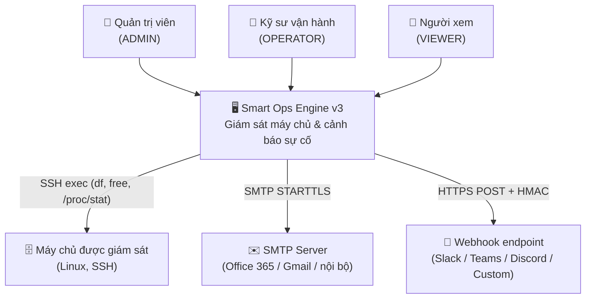
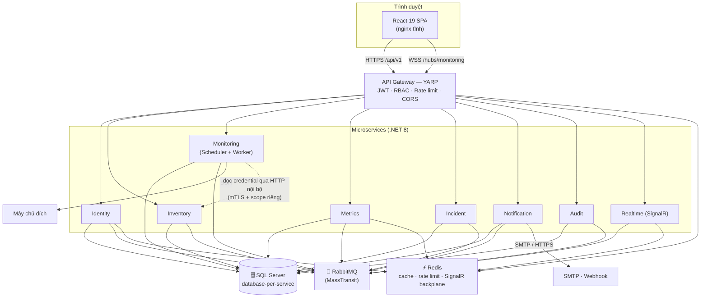
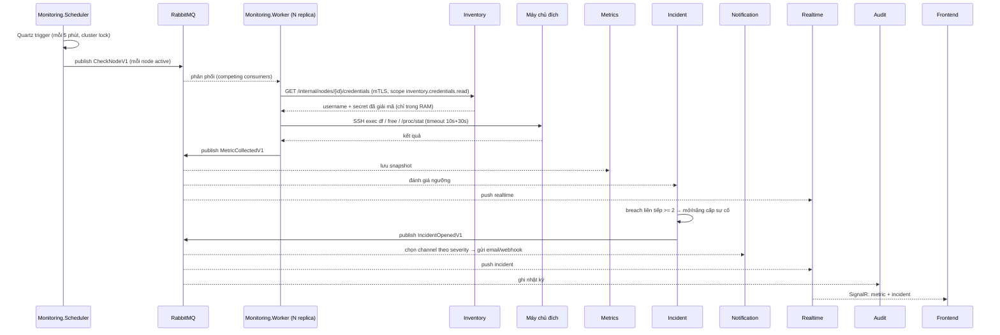
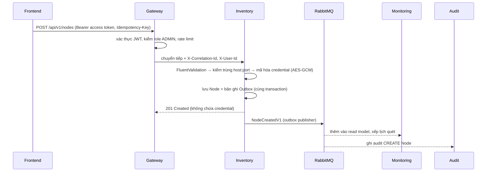
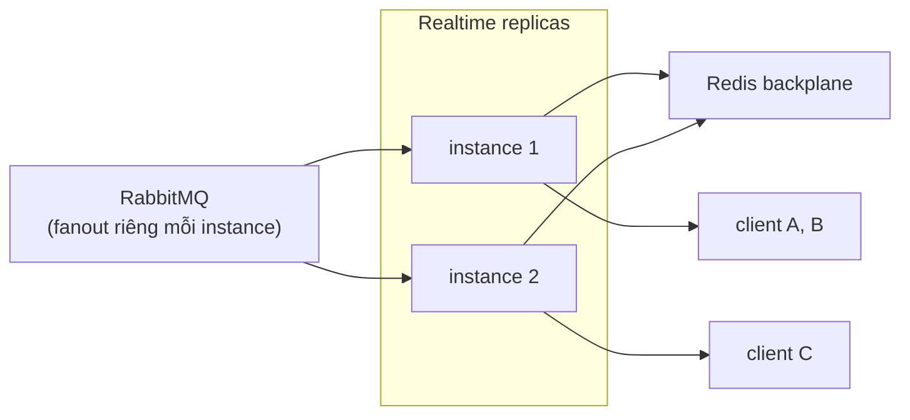

# Kiến trúc hệ thống — Smart Ops Engine v3

> Liên quan: [SOLID & Clean Architecture](solid_clean_architecture.md) · [Messaging](messaging_events.md) · [Gateway & Security](api_gateway_security.md) · [Dữ liệu](data_architecture.md) · [Triển khai & Scale](deployment_scaling.md)

---

## 1. Sơ đồ ngữ cảnh (C4 — Level 1)

## 2. Sơ đồ container (C4 — Level 2)

## 3. Danh mục service

| # | Service | Cổng nội bộ | Trách nhiệm | Database | Scale |
|---|---|---|---|---|---|
| 0 | **Gateway** (`SOE.Gateway`) | 8080 | Điểm vào duy nhất; xác thực JWT, phân quyền thô, rate limit, CORS, security header, correlation-id, WebSocket passthrough | — | HPA theo CPU/RPS |
| 1 | **Identity** (`SOE.Identity`) | 8080 | Người dùng, đăng nhập, JWT RS256 + JWKS, refresh token rotation, khóa tài khoản, đổi mật khẩu, token service-to-service | `soe_identity` | 2+ replica |
| 2 | **Inventory** (`SOE.Inventory`) | 8080 | CRUD Node, mã hóa credential, ghim host key, cờ giám sát, test kết nối | `soe_inventory` | 2+ replica |
| 3 | **Monitoring** (`SOE.Monitoring`) | 8080 | *Scheduler API* (Quartz clustered) phát `CheckNodeV1`; *Worker* tiêu thụ và chạy SSH | `soe_monitoring` | **Worker scale theo KEDA (độ dài queue)**; Scheduler 2 replica nhưng chỉ 1 job chạy nhờ cluster lock |
| 4 | **Metrics** (`SOE.Metrics`) | 8080 | Lưu snapshot, rollup theo giờ, API truy vấn lịch sử & metric mới nhất, retention job | `soe_metrics` | 2+ replica |
| 5 | **Incident** (`SOE.Incident`) | 8080 | Threshold policy, đánh giá breach, dedup, vòng đời sự cố, thống kê | `soe_incident` | 2+ replica |
| 6 | **Notification** (`SOE.Notification`) | 8080 | Alert channel, gửi email/webhook, throttle, retry, daily report, lịch sử gửi | `soe_notification` | 2+ replica |
| 7 | **Realtime** (`SOE.Realtime`) | 8080 | SignalR hub `/hubs/monitoring`, nhóm theo node & vai trò, Redis backplane | — (stateless) | 2+ replica |
| 8 | **Audit** (`SOE.Audit`) | 8080 | Nhận mọi domain/integration event + hành động ghi, lưu append-only, tra cứu & xuất CSV | `soe_audit` | 2 replica |

> Mỗi service đều phơi `/health/live`, `/health/ready`, `/metrics` (Prometheus) — **chỉ trong mạng nội bộ**, không định tuyến qua Gateway.

## 4. Ranh giới nghiệp vụ (bounded context) & sở hữu dữ liệu

| Dữ liệu | Chủ sở hữu | Các service khác dùng bằng cách nào |
|---|---|---|
| User, Role, Refresh token | Identity | Qua JWT claim; không truy vấn chéo DB |
| Node (host, port, username, credential, cờ giám sát) | Inventory | Monitoring giữ **read model** (`MonitoredNode`: id, host, port, username, interval, cờ giám sát, fingerprint) đồng bộ qua event; **credential chỉ lấy đúng lúc chạy qua API nội bộ** |
| Lịch quét, kết quả thu thập | Monitoring | Phát `MetricCollectedV1` / `NodeUnreachableV1` |
| Metric snapshot & rollup | Metrics | FE gọi API; Incident không đọc DB Metrics mà nghe event |
| Threshold policy, Incident | Incident | Phát `IncidentOpenedV1` / `IncidentEscalatedV1` / `IncidentResolvedV1` |
| Alert channel, lịch sử gửi | Notification | — |
| Audit entry | Audit | Chỉ ghi từ event; không service nào ghi trực tiếp |

**Nguyên tắc:** không service nào truy cập database của service khác. Trao đổi chỉ qua (a) integration event trên RabbitMQ, hoặc (b) HTTP nội bộ có token client-credentials cho trường hợp cần đồng bộ (đọc credential SSH).

## 5. Luồng chính

### 5.1 Chu kỳ quét định kỳ (đường đi chính của hệ thống)

Khi SSH thất bại: Worker phát `NodeUnreachableV1` → Incident mở sự cố `NODE_UNREACHABLE` → Notification cảnh báo.

### 5.2 Thao tác người dùng (ví dụ: tạo Node)

### 5.3 Realtime

Mỗi instance Realtime đăng ký queue **riêng (auto-delete)** để tất cả instance đều nhận event, rồi đẩy xuống client đang kết nối với mình; Redis backplane dùng khi phát theo group xuyên instance.

## 6. Quyết định kiến trúc (ADR tóm tắt)

| ID | Quyết định | Lý do | Đánh đổi |
|---|---|---|---|
| ADR-01 | Tách Scheduler và Worker qua queue | Scale phần tốn thời gian (SSH I/O) độc lập; scheduler chỉ phát lệnh | Thêm hạ tầng RabbitMQ |
| ADR-02 | RabbitMQ + MassTransit thay Kafka | Quy mô ≤ vài nghìn message/phút; cần retry/DLQ/outbox sẵn có, vận hành đơn giản | Không phù hợp nếu sau này cần replay log dài hạn |
| ADR-03 | Database-per-service trên cùng một SQL Server instance | Giữ ranh giới dữ liệu nhưng không tốn chi phí nhiều instance | Cần tách instance khi tải tăng |
| ADR-04 | Credential SSH **không** đi qua message | Giảm bề mặt lộ secret (queue có thể bị đọc/lưu) | Worker phụ thuộc Inventory lúc chạy → cần retry/circuit breaker |
| ADR-05 | JWT RS256 + JWKS thay HS256 | Service tự xác minh, không chia sẻ secret ký | Cần quản lý vòng đời khóa |
| ADR-06 | YARP thay Ocelot | Hiệu năng tốt, cùng nhà .NET, cấu hình động, hỗ trợ WebSocket | Ít plugin cộng đồng hơn |
| ADR-07 | Quartz.NET clustered cho scheduler | Chống chạy trùng job khi nhiều replica | Cần bảng Quartz trong `soe_monitoring` |
| ADR-08 | Giữ React SPA hiện có | Tận dụng 9 màn hình đã dựng; chỉ thay lớp dữ liệu | Phải refactor state từ localStorage sang server state |
| ADR-09 | Transactional outbox + idempotent consumer | Không mất/không nhân đôi hiệu ứng nghiệp vụ | Thêm bảng, thêm độ trễ nhỏ |
| ADR-10 | Realtime tách service riêng | Kết nối WebSocket dài hạn có mô hình tài nguyên khác REST | Thêm một service phải vận hành |

## 7. Ma trận service × event (tóm tắt)

| Event | Phát bởi | Tiêu thụ bởi |
|---|---|---|
| `NodeCreatedV1` / `NodeUpdatedV1` / `NodeDeletedV1` / `NodeMonitoringToggledV1` | Inventory | Monitoring, Metrics (xóa dữ liệu), Incident (đóng sự cố), Realtime, Audit |
| `CheckNodeV1` *(command)* | Monitoring.Scheduler, Monitoring API (check-now) | Monitoring.Worker |
| `MetricCollectedV1` | Monitoring.Worker | Metrics, Incident, Realtime |
| `NodeUnreachableV1` | Monitoring.Worker | Incident, Realtime, Audit |
| `IncidentOpenedV1` / `IncidentEscalatedV1` / `IncidentAcknowledgedV1` / `IncidentResolvedV1` | Incident | Notification, Realtime, Audit |
| `AlertDispatchedV1` / `AlertFailedV1` | Notification | Audit, Realtime |
| `UserLoggedInV1` / `UserLockedV1` / `UserChangedV1` | Identity | Audit |
| `AuditRequestedV1` | Mọi service (thao tác ghi) | Audit |

Chi tiết schema từng event: [messaging_events.md](messaging_events.md).
