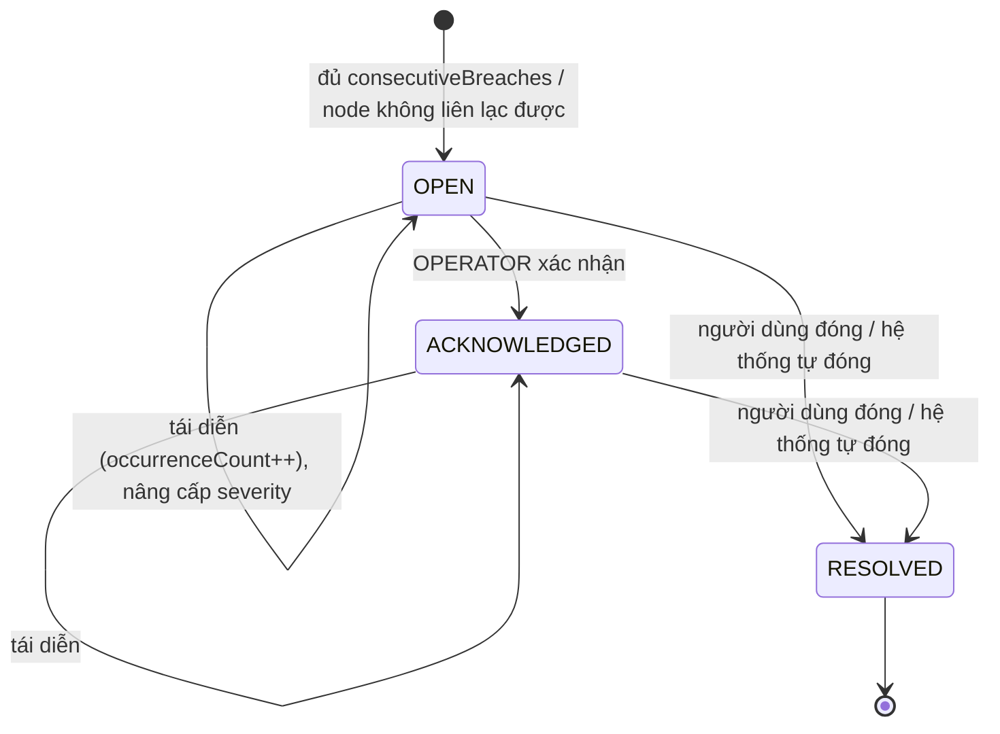

# SRS 05 — Incident Service (`INC`)

> Chính sách ngưỡng, phát hiện sự cố, chống trùng lặp và vòng đời xử lý.
> Liên quan: [data_architecture.md §3.5](../01_architecture/data_architecture.md) · [SRS Notification](06_notification.md)

---

## 1. Mục đích & phạm vi

Incident là “bộ não” nghiệp vụ: nghe `MetricCollectedV1`/`NodeUnreachableV1`, so với chính sách ngưỡng, quyết định **khi nào mở sự cố, khi nào chỉ đếm thêm, khi nào nâng cấp mức độ, khi nào tự đóng**. Service này khắc phục ba điểm yếu của v1: không dedup, không hysteresis, không auto-resolve.

## 2. Yêu cầu chức năng

### 2.1 Chính sách ngưỡng

| ID | Yêu cầu | Ưu tiên |
|---|---|---|
| FR-INC-001 | Có chính sách ngưỡng toàn cục cho CPU / MEMORY / DISK với `warning`, `critical`, `consecutiveBreaches`, `recoveryMargin`, `consecutiveRecoveries`. | Must |
| FR-INC-002 | ADMIN sửa chính sách toàn cục; giá trị mặc định: Disk 80/90, CPU 75/85, Memory 80/90, `consecutiveBreaches = 2`, `recoveryMargin = 5`, `consecutiveRecoveries = 2`. | Must |
| FR-INC-003 | ADMIN đặt chính sách riêng cho một node, ghi đè chính sách toàn cục. | Should |
| FR-INC-004 | Có thể tắt đánh giá cho một loại metric (vd không cảnh báo CPU). | Should |
| FR-INC-005 | Thay đổi chính sách có hiệu lực từ snapshot kế tiếp, không hồi tố sự cố đã mở. | Must |

### 2.2 Phát hiện & vòng đời

| ID | Yêu cầu | Ưu tiên |
|---|---|---|
| FR-INC-010 | Khi giá trị ≥ ngưỡng, tăng `breachStreak`; đạt `consecutiveBreaches` thì mở sự cố. | Must |
| FR-INC-011 | Nếu đã có sự cố chưa đóng cùng `(nodeId, type)`, không tạo bản ghi mới mà tăng `occurrenceCount` và cập nhật `lastSeenAt`, `metricValue`. | Must |
| FR-INC-012 | Sự cố mức WARNING vượt tiếp ngưỡng CRITICAL ⇒ **nâng cấp** severity, phát `IncidentEscalatedV1` (không mở sự cố thứ hai). | Must |
| FR-INC-013 | Giá trị xuống dưới `threshold − recoveryMargin` đủ `consecutiveRecoveries` lần ⇒ tự đóng sự cố với `resolvedSource = SYSTEM`. | Must |
| FR-INC-014 | `NodeUnreachableV1` mở sự cố `NODE_UNREACHABLE` (CRITICAL) ngay từ lần đầu; `HostKeyMismatch`/`AuthFailed` mở sự cố tương ứng. | Must |
| FR-INC-015 | Nhận được `MetricCollectedV1` thành công ⇒ tự đóng sự cố `NODE_UNREACHABLE` đang mở. | Must |
| FR-INC-016 | OPERATOR+ xác nhận (acknowledge) sự cố kèm ghi chú; chỉ áp dụng cho trạng thái `OPEN`. | Must |
| FR-INC-017 | OPERATOR+ đóng sự cố thủ công kèm mô tả hành động xử lý. | Must |
| FR-INC-018 | Khi node bị xóa hoặc tắt giám sát, mọi sự cố chưa đóng của node được đóng với lý do hệ thống. | Must |
| FR-INC-019 | Ghi nhật ký vòng đời (`IncidentEvents`) cho mọi chuyển trạng thái. | Must |
| FR-INC-020 | Bỏ qua snapshot đến muộn (`collectedAt` ≤ `lastProcessedAt`) để tránh sai lệch chuỗi đếm. | Must |

### 2.3 Truy vấn

| ID | Yêu cầu | Ưu tiên |
|---|---|---|
| FR-INC-030 | Danh sách sự cố có lọc `status`, `severity`, `type`, `nodeId`, `from`/`to`, tìm kiếm theo tên node; phân trang, sắp xếp mặc định mới nhất trước. | Must |
| FR-INC-031 | Chi tiết một sự cố kèm dòng thời gian (`IncidentEvents`) và metric quanh thời điểm phát hiện. | Should |
| FR-INC-032 | Thống kê: số sự cố mở theo severity, số mở/đóng trong 24h, MTTR (thời gian xử lý trung bình), top 5 node nhiều sự cố. | Should |
| FR-INC-033 | Xuất CSV danh sách sự cố theo bộ lọc. | Could |

## 3. Quy tắc nghiệp vụ

| ID | Quy tắc |
|---|---|
| BR-INC-001 | Ràng buộc DB: tối đa một sự cố `Status <> RESOLVED` cho mỗi `(nodeId, type)` — dedup được bảo đảm ở cả tầng ứng dụng và CSDL. |
| BR-INC-002 | `warning < critical`; `recoveryMargin` ≥ 0 và `threshold − recoveryMargin` > 0. |
| BR-INC-003 | Chỉ sự cố `OPEN` mới acknowledge được; sự cố `RESOLVED` không thể acknowledge hay resolve lại. |
| BR-INC-004 | Auto-resolve không ghi đè `ResolutionAction` do người dùng nhập trước đó. |
| BR-INC-005 | `NodeName` được sao chép vào sự cố để vẫn hiển thị đúng sau khi node bị xóa. |
| BR-INC-006 | Nâng cấp severity chỉ theo chiều tăng (WARNING → CRITICAL); giảm mức không hạ severity mà đi theo luồng auto-resolve. |
| BR-INC-007 | Sự cố tự đóng vẫn giữ nguyên `occurrenceCount` và dòng thời gian để phục vụ phân tích. |
| BR-INC-008 | Mô tả sự cố sinh theo mẫu tiếng Việt, ví dụ: “Disk `/` đạt 91.2% (ngưỡng nguy cấp 90%)”. |

## 4. Máy trạng thái



Loại sự cố (`type`): `CPU_HIGH`, `MEMORY_HIGH`, `DISK_HIGH`, `NODE_UNREACHABLE`, `HOST_KEY_MISMATCH`, `AUTH_FAILED`.

## 5. Thuật toán đánh giá

```
EvaluateThresholdConsumer(MetricCollectedV1 m):
  nếu m.collectedAt <= state.lastProcessedAt  → bỏ qua            (FR-INC-020)
  policy = policyResolver.Resolve(m.nodeId, metricType)            (node override → global)
  nếu !policy.IsEnabled → bỏ qua
  value = m[metricType]; nếu value == null → bỏ qua metric đó

  nếu value >= policy.Critical:        level = CRITICAL
  ngược lại nếu value >= policy.Warning: level = WARNING
  ngược lại:                            level = NORMAL

  nếu level == NORMAL:
      state.recoveryStreak++ nếu value < ngưỡng hiện hành − recoveryMargin
      state.breachStreak = 0
      nếu state.recoveryStreak >= policy.ConsecutiveRecoveries:
          incident?.Resolve(SYSTEM, "Chỉ số đã trở lại bình thường.")   (FR-INC-013)
  ngược lại:
      state.breachStreak++; state.recoveryStreak = 0
      nếu tồn tại sự cố chưa đóng:
          incident.RecordRecurrence(now)                                 (FR-INC-011)
          nếu level == CRITICAL và incident.Severity == WARNING:
              incident.Escalate(CRITICAL)                                (FR-INC-012)
      ngược lại nếu state.breachStreak >= policy.ConsecutiveBreaches:
          Incident.Open(...)                                             (FR-INC-010)
  state.lastProcessedAt = m.collectedAt;  lưu (transaction + outbox)
```

## 6. Hợp đồng API

| Method | Endpoint | Quyền | Mô tả |
|---|---|---|---|
| GET | `/api/v1/incidents?status=&severity=&type=&nodeId=&from=&to=&search=&page=&pageSize=` | VIEWER+ | Danh sách phân trang |
| GET | `/api/v1/incidents/{id}` | VIEWER+ | Chi tiết + dòng thời gian |
| PUT | `/api/v1/incidents/{id}/acknowledge` | OPERATOR+ | `{ "note": "Đang kiểm tra" }` → 200; 409 `SOE-INC-409` nếu không ở trạng thái OPEN |
| PUT | `/api/v1/incidents/{id}/resolve` | OPERATOR+ | `{ "resolutionAction": "Đã dọn log cũ, disk còn 62%" }` → 200; 409 nếu đã đóng |
| GET | `/api/v1/incidents/stats?range=24h` | VIEWER+ | Thống kê |
| GET | `/api/v1/incidents/export` | OPERATOR+ | CSV theo bộ lọc |
| GET | `/api/v1/threshold-policies` | VIEWER+ | Chính sách toàn cục + danh sách override |
| PUT | `/api/v1/threshold-policies/global` | ADMIN | Cập nhật toàn cục |
| PUT | `/api/v1/threshold-policies/nodes/{nodeId}` | ADMIN | Đặt/gỡ override |

```json
// IncidentResponse
{
  "id": "0192c…", "nodeId": "0192b…", "nodeName": "prod-web-01",
  "type": "DISK_HIGH", "severity": "CRITICAL", "status": "OPEN",
  "description": "Disk / đạt 91.2% (ngưỡng nguy cấp 90%)",
  "metricValue": 91.2, "thresholdValue": 90,
  "occurrenceCount": 4,
  "detectedAt": "2026-09-23T08:05:12Z", "lastSeenAt": "2026-09-23T08:30:12Z",
  "acknowledgedAt": null, "acknowledgedBy": null,
  "resolvedAt": null, "resolvedSource": null, "resolutionAction": null
}
```

## 7. Validate

| Trường | Quy tắc |
|---|---|
| `note` (acknowledge) | ≤ 500 ký tự |
| `resolutionAction` | bắt buộc khi đóng thủ công, 3–1000 ký tự |
| `warning`, `critical` | 1–100, `warning < critical` |
| `consecutiveBreaches`, `consecutiveRecoveries` | 1–10 |
| `recoveryMargin` | 0–50 |
| `status`, `severity`, `type` | thuộc enum |
| `from`,`to` | ISO-8601, khoảng ≤ 365 ngày |

## 8. Sự kiện

**Tiêu thụ:** `MetricCollectedV1`, `NodeUnreachableV1`, `NodeDeletedV1`, `NodeMonitoringToggledV1`.
**Phát:** `IncidentOpenedV1`, `IncidentEscalatedV1`, `IncidentAcknowledgedV1`, `IncidentResolvedV1`.

## 9. Phía Frontend

**Màn hình:** `Incidents`, khối “Sự cố gần đây” trên `Dashboard`, tab sự cố trong `NodeDetail`, phần ngưỡng trong `SystemConfig`.

| ID | Yêu cầu |
|---|---|
| FR-INC-FE-001 | Danh sách sự cố có bộ lọc trạng thái/mức độ/loại/node và khoảng thời gian; bộ lọc lưu trong URL; phân trang phía server. |
| FR-INC-FE-002 | Hàng sự cố hiển thị mức độ bằng badge có nhãn chữ (“Nguy cấp”, “Cảnh báo”) — không chỉ dựa vào màu. |
| FR-INC-FE-003 | Số lần tái diễn hiển thị dạng “×4” kèm tooltip “Lần gần nhất: 08:30:12”. |
| FR-INC-FE-004 | Hộp thoại “Xác nhận xử lý” và “Đóng sự cố” yêu cầu nhập nội dung (resolve), validate độ dài, khóa nút khi đang gửi. |
| FR-INC-FE-005 | Cập nhật optimistic khi acknowledge/resolve, rollback và hiện lỗi nếu API trả 409. |
| FR-INC-FE-006 | Sự cố mới đến qua realtime: chèn lên đầu danh sách (nếu khớp bộ lọc), hiện toast đỏ và cập nhật bộ đếm trên Dashboard. |
| FR-INC-FE-007 | Trang chi tiết hiển thị dòng thời gian (mở → tái diễn → nâng cấp → xác nhận → đóng) và biểu đồ metric quanh thời điểm phát hiện. |
| FR-INC-FE-008 | Màn hình cấu hình ngưỡng (ADMIN): 3 nhóm CPU/RAM/Disk, validate `warning < critical` ngay khi nhập, xem trước ảnh hưởng (“Với dữ liệu 24h qua, cấu hình này sẽ tạo N sự cố”). |
| FR-INC-FE-009 | VIEWER không thấy nút xác nhận/đóng sự cố. |

## 10. Phi chức năng & rủi ro

| Hạng mục | Nội dung |
|---|---|
| Hiệu năng | Xử lý một `MetricCollectedV1` p95 ≤ 50 ms; danh sách sự cố p95 ≤ 300 ms với 100.000 bản ghi |
| Tính đúng | Gửi lại cùng message 3 lần ⇒ vẫn một sự cố, `occurrenceCount` không tăng sai (idempotent theo `MessageId`) |
| Rủi ro | Chính sách quá nhạy gây bão cảnh báo → có `consecutiveBreaches`, hysteresis và throttle ở Notification; có thể tắt nhanh đánh giá một loại metric |
| Rủi ro | Xung đột đồng thời khi nhiều snapshot cùng node đến song song → optimistic concurrency + retry |
