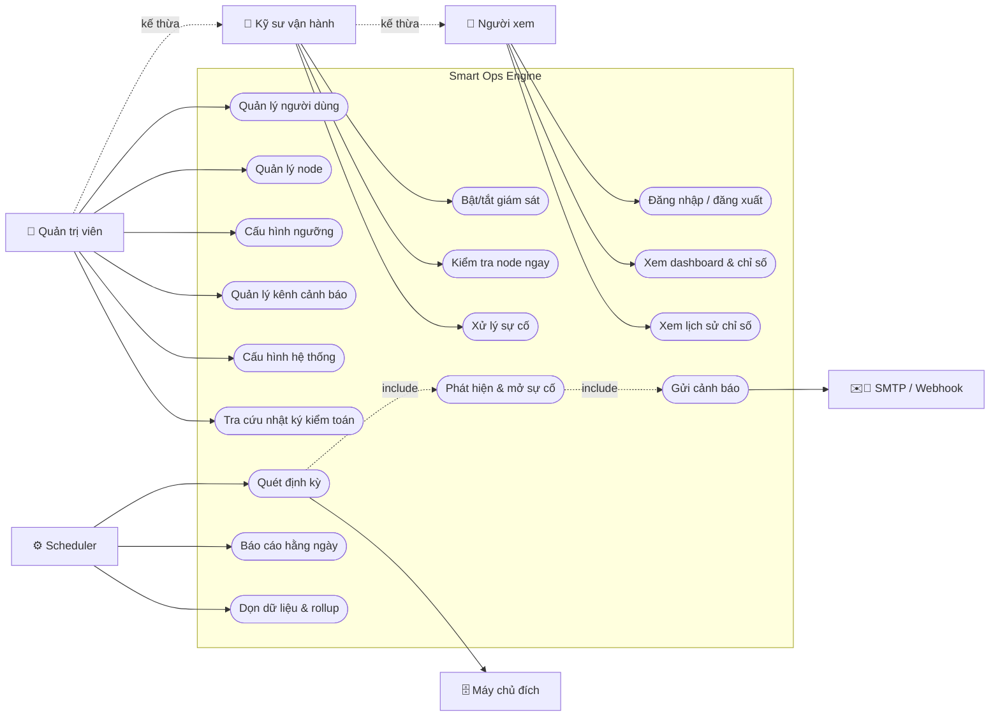

# Use Case — Tổng quan

## 1. Actor

| Actor | Loại | Mô tả | Vai trò hệ thống |
|---|---|---|---|
| **Quản trị viên** | Chính | Cấu hình node, người dùng, kênh cảnh báo, ngưỡng, cấu hình hệ thống | `ADMIN` |
| **Kỹ sư vận hành** | Chính | Theo dõi dashboard, xử lý sự cố, kiểm tra node theo yêu cầu | `OPERATOR` |
| **Người xem** | Chính | Chỉ xem dashboard, sự cố, lịch sử chỉ số | `VIEWER` |
| **Scheduler** | Hệ thống | Kích hoạt chu kỳ quét, báo cáo hằng ngày, rollup, dọn dữ liệu | — |
| **Worker giám sát** | Hệ thống | Thực hiện kết nối SSH và thu thập chỉ số | — |
| **Máy chủ đích** | Ngoài | Nhận kết nối SSH, trả kết quả lệnh | — |
| **SMTP server** | Ngoài | Nhận và chuyển email cảnh báo | — |
| **Webhook endpoint** | Ngoài | Nhận HTTP POST cảnh báo (Slack/Teams/Discord/tùy chỉnh) | — |

Quan hệ kế thừa: `ADMIN` ⊃ `OPERATOR` ⊃ `VIEWER` (mọi use case của vai trò thấp đều thực hiện được bởi vai trò cao hơn, trừ khi ghi rõ khác).

## 2. Sơ đồ use case tổng quát



## 3. Danh mục use case

| ID | Tên | Actor chính | FR liên quan | Tài liệu |
|---|---|---|---|---|
| UC-IDN-01 | Đăng nhập hệ thống | Mọi vai trò | FR-IDN-001, 005 | [UC-01_auth.md](UC-01_auth.md) |
| UC-IDN-02 | Duy trì phiên & đăng xuất | Mọi vai trò | FR-IDN-002, 003, 004 | [UC-01_auth.md](UC-01_auth.md) |
| UC-IDN-03 | Đổi mật khẩu | Mọi vai trò | FR-IDN-008 | [UC-01_auth.md](UC-01_auth.md) |
| UC-IDN-04 | Quản lý người dùng | ADMIN | FR-IDN-006, 007, 013…015 | [UC-01_auth.md](UC-01_auth.md) |
| UC-INV-01 | Thêm node mới | ADMIN | FR-INV-001…004, 010, 011 | [UC-02_node.md](UC-02_node.md) |
| UC-INV-02 | Sửa thông tin node | ADMIN | FR-INV-005, 008, 009 | [UC-02_node.md](UC-02_node.md) |
| UC-INV-03 | Bật/tắt giám sát node | OPERATOR | FR-INV-006 | [UC-02_node.md](UC-02_node.md) |
| UC-INV-04 | Xóa node | ADMIN | FR-INV-007 | [UC-02_node.md](UC-02_node.md) |
| UC-INV-05 | Xử lý thay đổi host key | ADMIN | FR-INV-011, BR-INV-006 | [UC-02_node.md](UC-02_node.md) |
| UC-MON-01 | Quét định kỳ toàn hệ thống | Scheduler | FR-MON-002…004, 006…011 | [UC-03_monitoring.md](UC-03_monitoring.md) |
| UC-MON-02 | Kiểm tra node ngay | OPERATOR | FR-MON-005 | [UC-03_monitoring.md](UC-03_monitoring.md) |
| UC-MON-03 | Xử lý node không truy cập được | Worker | FR-MON-009…011, FR-INC-014 | [UC-03_monitoring.md](UC-03_monitoring.md) |
| UC-MET-01 | Xem dashboard tổng quan | VIEWER | FR-MET-004, 012 | [UC-04_metrics.md](UC-04_metrics.md) |
| UC-MET-02 | Xem lịch sử chỉ số một node | VIEWER | FR-MET-005, 006 | [UC-04_metrics.md](UC-04_metrics.md) |
| UC-MET-03 | Xuất dữ liệu chỉ số | OPERATOR | FR-MET-011 | [UC-04_metrics.md](UC-04_metrics.md) |
| UC-INC-01 | Phát hiện và mở sự cố | Hệ thống | FR-INC-010…012 | [UC-05_incident.md](UC-05_incident.md) |
| UC-INC-02 | Xác nhận xử lý sự cố | OPERATOR | FR-INC-016 | [UC-05_incident.md](UC-05_incident.md) |
| UC-INC-03 | Đóng sự cố | OPERATOR | FR-INC-017 | [UC-05_incident.md](UC-05_incident.md) |
| UC-INC-04 | Tự động đóng sự cố khi hồi phục | Hệ thống | FR-INC-013, 015 | [UC-05_incident.md](UC-05_incident.md) |
| UC-INC-05 | Cấu hình ngưỡng cảnh báo | ADMIN | FR-INC-001…005 | [UC-05_incident.md](UC-05_incident.md) |
| UC-NTF-01 | Gửi cảnh báo sự cố | Hệ thống | FR-NTF-010…016 | [UC-06_notification.md](UC-06_notification.md) |
| UC-NTF-02 | Quản lý kênh cảnh báo | ADMIN | FR-NTF-001…005, 007 | [UC-06_notification.md](UC-06_notification.md) |
| UC-NTF-03 | Gửi thử kênh cảnh báo | ADMIN | FR-NTF-004 | [UC-06_notification.md](UC-06_notification.md) |
| UC-NTF-04 | Báo cáo sức khỏe hằng ngày | Scheduler | FR-NTF-017 | [UC-06_notification.md](UC-06_notification.md) |
| UC-RTM-01 | Theo dõi cập nhật thời gian thực | VIEWER | FR-RTM-001…006 | [UC-07_realtime_audit_config.md](UC-07_realtime_audit_config.md) |
| UC-AUD-01 | Tra cứu nhật ký kiểm toán | ADMIN | FR-AUD-005, 006, 010 | [UC-07_realtime_audit_config.md](UC-07_realtime_audit_config.md) |
| UC-GW-01 | Cấu hình hệ thống | ADMIN | FR-GW-020…027 | [UC-07_realtime_audit_config.md](UC-07_realtime_audit_config.md) |
| UC-GW-02 | Chặn truy cập trái phép | Hệ thống | FR-GW-002…004 | [UC-07_realtime_audit_config.md](UC-07_realtime_audit_config.md) |

## 4. Bố cục mỗi use case

```
ID · Tên
Actor chính / Actor phụ · Mức ưu tiên · Tần suất
Tiền điều kiện · Kích hoạt (trigger)
Luồng chính (các bước đánh số)
Luồng thay thế (A1, A2…)
Luồng ngoại lệ (E1, E2…)
Hậu điều kiện (thành công / thất bại)
Quy tắc nghiệp vụ liên quan · Yêu cầu phi chức năng · Test case liên quan
```
