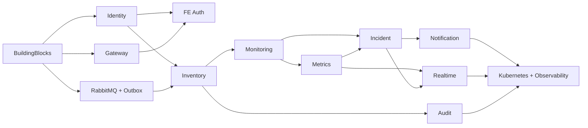

# Kế hoạch phân chia công việc

> Ai làm gì, ở thư mục nào, theo thứ tự nào. Cập nhật mỗi khi một hạng mục hoàn tất.
> Trạng thái: ✅ xong · 🟡 đang làm · 🔜 chưa bắt đầu · 🔴 nợ kỹ thuật

---

## 1. Bảng phân chia theo thư mục

| Hạng mục công việc | Thư mục phụ trách | Đặc tả | Test case | Mốc | Trạng thái |
|---|---|---|---|---|---|
| Khối dùng chung | `apps/backend-v3/src/BuildingBlocks/` | [solid_clean_architecture](01_architecture/solid_clean_architecture.md) | — | M1 | ✅ |
| API Gateway | `apps/backend-v3/src/Gateway/` | [09_gateway_config](02_srs/09_gateway_config.md) | [TC-09](04_test_cases/TC-09_gateway_config.md) | M1 | 🟡 thiếu test |
| Identity | `.../src/Services/Identity/` | [01_identity](02_srs/01_identity.md) | [TC-01](04_test_cases/TC-01_identity.md) | M1 | ✅ |
| Giao diện đăng nhập & người dùng | `apps/web/src/features/auth`, `.../users` | [frontend_architecture](01_architecture/frontend_architecture.md) | TC-IDN-E2E-* | M1 | 🔜 |
| Inventory | `.../src/Services/Inventory/` | [02_inventory](02_srs/02_inventory.md) | [TC-02](04_test_cases/TC-02_inventory.md) | M2 | 🔜 |
| Monitoring | `.../src/Services/Monitoring/` | [03_monitoring](02_srs/03_monitoring.md) | [TC-03](04_test_cases/TC-03_monitoring.md) | M2 | 🔜 |
| Metrics | `.../src/Services/Metrics/` | [04_metrics](02_srs/04_metrics.md) | [TC-04](04_test_cases/TC-04_metrics.md) | M2 | 🔜 |
| Hạ tầng message (RabbitMQ + outbox) | `.../src/BuildingBlocks/SOE.BuildingBlocks.Infrastructure/` | [messaging_events](01_architecture/messaging_events.md) | [contract_messaging_tests](04_test_cases/contract_messaging_tests.md) | M2 | 🔜 |
| Incident | `.../src/Services/Incident/` | [05_incident](02_srs/05_incident.md) | [TC-05](04_test_cases/TC-05_incident.md) | M3 | 🔜 |
| Notification | `.../src/Services/Notification/` | [06_notification](02_srs/06_notification.md) | [TC-06](04_test_cases/TC-06_notification.md) | M3 | 🔜 |
| Realtime | `.../src/Services/Realtime/` | [07_realtime](02_srs/07_realtime.md) | [TC-07](04_test_cases/TC-07_realtime.md) | M4 | 🔜 |
| Audit | `.../src/Services/Audit/` | [08_audit](02_srs/08_audit.md) | [TC-08](04_test_cases/TC-08_audit.md) | M4 | 🔜 |
| Màn hình còn lại của giao diện | `apps/web/src/features/*` | [frontend_architecture](01_architecture/frontend_architecture.md) | TC-*-E2E-* | M2–M4 | 🔜 |
| Kubernetes, KEDA, HPA | `deploy/k8s/` | [deployment_scaling](01_architecture/deployment_scaling.md) | [performance_scaling_tests](04_test_cases/performance_scaling_tests.md) | M5 | 🔜 |
| Quan sát (log, trace, metric) | mọi service + `deploy/` | [observability](01_architecture/observability.md) | — | M5 | 🔜 |
| CI/CD | `.github/workflows/` | [deployment_scaling §6](01_architecture/deployment_scaling.md) | — | M1–M5 | 🔜 |
| Kiểm thử hiệu năng & bảo mật | `tools/perf/`, `apps/web/tests/` | [nfr](01_architecture/nfr.md) | [security_tests](04_test_cases/security_tests.md) | M5 | 🔜 |
| Bảo trì bản v1 | `apps/legacy-v1/` | [legacy-v1/SRS](legacy-v1/SRS/README.md) | [legacy-v1/test_cases](legacy-v1/test_cases/README.md) | — | 🟢 chỉ sửa lỗi |

---

## 2. Thứ tự triển khai (phụ thuộc giữa các hạng mục)

**Đường găng:** BuildingBlocks → Identity → Inventory → Monitoring → Incident → Notification.
Giao diện và Audit chạy song song được; Kubernetes làm sau cùng.

---

## 3. Việc đang nợ của M1

| # | Việc | Thư mục | Test case liên quan | Ưu tiên |
|---|---|---|---|---|
| 1 | Nối giao diện vào API thật (bỏ mock): cài axios, TanStack Query, zod, react-hook-form; tách `AppContext` | `apps/web/src/` | TC-IDN-E2E-001…012 | P1 |
| 2 | Test tích hợp API bằng `WebApplicationFactory` + Testcontainers | `apps/backend-v3/tests/SOE.IntegrationTests/` | TC-IDN-API-* | P1 |
| 3 | Test cho Gateway (định tuyến, JWT, RBAC, rate limit, header) — smoke `tools/scripts/smoke-m1.ps1` mới phủ TC-GW-SEC-001…003 | `apps/backend-v3/tests/SOE.Gateway.Tests/` | TC-GW-SEC-001…018 | P1 |
| 4 | Rate limit dùng Redis thay bộ đếm trong tiến trình | `.../src/Gateway/`, `.../Identity.Api` | TC-GW-SEC-012 | P2 |
| 5 | Khóa ký JWT cố định (PEM qua secret) thay khóa tạm sinh khi khởi động | `deploy/docker/.env`, `tools/scripts/` | TC-GW-SEC-007 | P2 |
| 6 | Workflow CI đầu tiên (build + test + quét bảo mật) — có thể gọi lại `tools/scripts/test-all.ps1` | `.github/workflows/` | — | P2 |

---

## 4. Định nghĩa “hoàn thành” cho một service

Một service chỉ được coi là xong khi đủ **tất cả** các mục sau:

- [ ] Đủ 4 lớp theo khuôn hình Clean Architecture; `SOE.ArchitectureTests` xanh
- [ ] Toàn bộ `FR-*` trong SRS tương ứng đã hiện thực, hoặc được ghi rõ là hoãn kèm lý do
- [ ] Validate hai phía khớp bảng quy tắc trong SRS; lỗi trả về đúng chuẩn ProblemDetails tiếng Việt
- [ ] Unit test đạt ngưỡng coverage (Domain + Application ≥ 80%)
- [ ] Integration test cho các luồng chính; contract test cho event phát ra
- [ ] Có Dockerfile, mục trong docker-compose, health check `/health/live` + `/health/ready`
- [ ] Route + policy phân quyền đã khai báo ở Gateway
- [ ] Ghi audit cho mọi thao tác ghi
- [ ] Ma trận truy vết [05_traceability_matrix.md](05_traceability_matrix.md) đã cập nhật
- [ ] README của service chuyển trạng thái từ 🔜 sang ✅

---

## 5. Quy ước làm việc

| Chủ đề | Quy ước |
|---|---|
| Nhánh | `feat/<mã-module>-<mô-tả-ngắn>`, ví dụ `feat/inv-crud-node` |
| Commit | Bắt đầu bằng phạm vi: `inv:`, `mon:`, `gw:`, `web:`, `docs:`, `deploy:` |
| Pull request | Nêu rõ `FR-*` đã hiện thực và `TC-*` đã chạy |
| Tài liệu | Sửa hành vi ⇒ cập nhật SRS + test case + ma trận truy vết trong **cùng** PR |
| Secret | Không bao giờ commit; thêm biến mới phải khai báo trong `deploy/docker/.env.example` |
